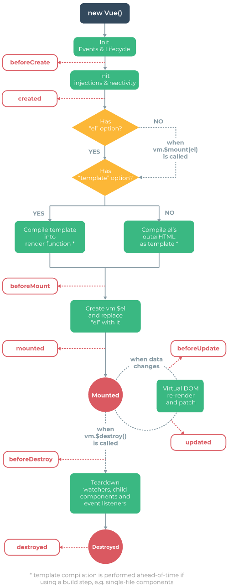
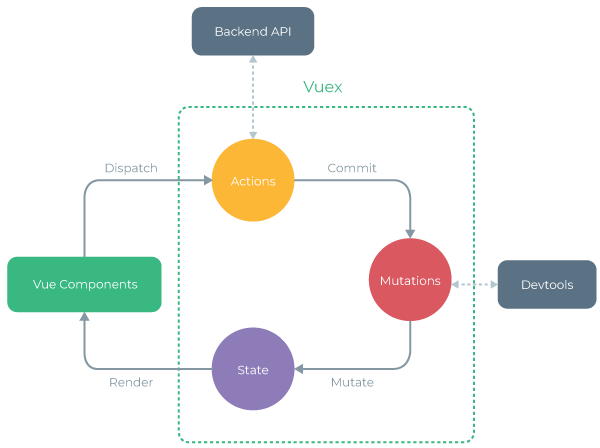
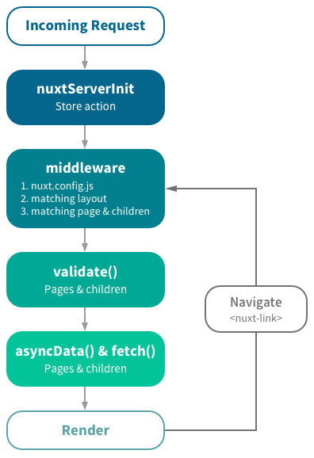

# Vue.js学习笔记

## 目录
1. [vue](#vue)
1. [vue-router](#vue-router)
1. [vuex](#vuex)
1. [vue-cli](#vue-cli)
1. [nuxt.js](#nuxtjs)
1. [jQuery与Vue.js对比](#jquery与vuejs对比)

### [vue](https://github.com/vuejs/vue)
1. 单向数据流（实现双向绑定效果），响应式

    编写的代码不关注底层逻辑，只关注用**单向数据流**实现的**双向绑定**效果。

    1. 重用DOM（尽量在已存在的DOM上做修改，而不是移除DOM再新建DOM）

        1. 当没有`key`属性或`key`属性相同时：最大化重用DOM。
        2. 切换的DOM的`key`属性不同：不重用DOM。
    2. Vue实例代理`data`、`methods`、`computed`、`props`的属性内容，可以直接修改或调用；也有以`$`开头的Vue实例属性（如`$el`、`$data`、`$watch`）。

        只有已经被代理的内容是响应的（Vue实例被创建时的`data`、`computed`），值的改变（可能）会触发视图的重新渲染。

        1. 导致视图更新：

            1. 数组的某些mutator方法：`push`、`pop`、`unshift`、`shift`、`reverse`、`sort`、`splice`
            2. 数组赋值
            3. 插值：`Vue.set(数组/对象, 索引/键, 新值)`
        2. 无法检测数组变动：

            1. 直接数组索引赋值。

                >导致视图更新的替代方法：`Vue.set(vm.items, index, value)`或`vm.items.splice(index, 1, value)`。
            2. 直接修改数组长度。

                >导致视图更新的替代方法：`vm.items.splice(newLength)`。
            3. 数组的最新mutator方法：`copyWithin`、`fill`
    3. 外层慎用~~箭头函数~~，`this`的指向无法按预期指向Vue实例。
    4. 因为HTML不区分大小写，所以大/小驼峰式命名的JS内容，在HTML使用时要转换为相应的短横线隔开式。

        不受限制、不需要转换：JS字符串模版、`.vue`组件。

        >JS字符串模版：`<script type="text/x-template">`、JS内联模板字符串。
2. 模板插值

    1. 支持JS表达式（单个），不支持~~语句~~、~~流控制~~。

        <details>
        <summary>e.g.</summary>
        
        ```html
        <!-- 可行 -->
        {{ number + 1 }}
        {{ ok ? 'YES' : 'NO' }}
        {{ Array.from(words).reverse().join('') }}
        <div v-bind:id="'list-' + id"></div>

        <!--
        是语句，不是表达式
        {{ var a = 1 }}

        流控制不会生效，请使用三元表达式
        {{ if ... }}

        不支持分号，无法添加多个表达式
        {{ message; 1 + 1 }}
        -->
        ```
        </details>
    2. 只能访问部分全局变量（白名单）；不允许访问自定义的全局变量（引入的其他库变量仅在JS代码中使用）。
    3. 作用域在所属Vue实例范围内。
    4. `slot="字符串"`、`<slot name="字符串">`用于父级向子组件插入内容。
    5. 所有渲染结果不包含`<template>`
3. 指令

    指令（Directives）是带有`v-`前缀的DOM的特殊属性。

    >JS表达式的值改变时，将响应式地改变DOM。

    1. `:`参数

        用于添加指令后的参数。
    2. `v-if`、`v-else`、`v-else-if`
    3. `v-for="值/(值, 键)/(值, 键, 索引) in/of JS表达式/整数"`

        ><details>
        ><summary>处于同一节点时，<code>v-for</code>比<code>v-if</code>优先级更高：意味着<code>v-if</code>将分别重复运行于每个<code>v-for</code>循环中</summary>
        >
        >```html
        ><!-- e.g. -->
        ><li v-for="todo in todos" v-if="!todo.isComplete">
        >  {{ todo }} v-if在v-for循环的每一次都运行判断
        ></li>
        >```
        ></details>

        - 在组件中使用`v-for`时，必须添加`key`属性
        - 尽可能在使用`v-for`时提供`key`属性（除非输出的DOM非常简单，或刻意重用DOM以获取性能提升）

            ```html
            <!-- e.g. -->
            <div v-for="item in items" :key="item.id">
              <!-- 内容 -->
            </div>
            ```

            >没有提供`key`属性：若数据项的顺序被改变，Vue将不会移动DOM元素来匹配数据项的顺序，而是简单复用每个元素，确保渲染内容正确。
    4. `v-bind`绑定DOM属性与JS表达式的结果。

        >此DOM属性随表达式最终值改变而改变，直接修改此DOM属性值不改变表达式的值。

        `v-bind:`缩写`:`。

        1. 绑定修饰符：

            <details>
            <summary><code>.sync</code></summary>
            
            >仅为语法糖
            
            `<my-component :foo.sync="bar"></my-component>`
        
            等价于
            
            `<my-component :foo="bar" @update:foo="val => bar = val"></my-component>`
            
            - 若要达到效果（同步更新bar），还需要在组件中添加：
            
                ```javascript
                Vue.component('myComponent', {
                  props: ['foo'],
                  template: '<p v-on:click="doIt">{{foo}}</p>',
                  methods: {
                    doIt () {
                      this.$emit('update:foo', 'new value') // 触发父级事件，父级事件改变值，再传入子组件
                    }
                  }
                })
                ```
            </details>
        2. 特殊的DOM属性：
        
            1. 绑定`class`
    
                1. `v-bind:class="{class名: Vue属性[, class名: Vue属性]}"`
                2. `v-bind:class="Vue属性对象"`
                3. `v-bind:class="[Vue属性[, Vue属性]]"`
                4. `v-bind:class="[Vue属性 ? Vue属性 : ''[, Vue属性]]"`
                5. `v-bind:class="[{class名: Vue属性}[, Vue属性]]"`
            2. 绑定`style`
    
                >1. 自动添加样式前缀。
                >2. CSS属性名可以用驼峰式（camelCase）或短横线分隔（kebab-case，需用单引号包裹）命名。
    
                1. `v-bind:style="{css属性: Vue属性[, css属性: Vue属性]}"`
                2. `v-bind:style="Vue属性对象"`
                3. `v-bind:style="[Vue属性[, Vue属性]]"`
                4. 多重值
        3. 传递给子组件DOM属性的值类型

            <details>
            <summary>e.g.</summary>

            ```html
            <!-- 传递字符串 -->
            <my-component some-prop="1">传递字符串'1'</my-component>
            <my-component some-prop="a">传递字符串'a'</my-component>

            <!-- 传递表达式的值 -->
            <my-component v-bind:some-prop="1">传递表达式：1（Number）</my-component>
            <my-component v-bind:some-prop="'1'">传递表达式：'1'（String）</my-component>
            <my-component v-bind:some-prop="a">传递表达式：a（变量是什么类型就是什么类型）</my-component>
            ```
            </details>
        4. 若不带参数的`v-bind="表达式"`，则绑定表达式的所有属性到DOM。

            <details>
            <summary>e.g.</summary>

            ```html
            <div id="test">
              <div v-bind="objs">绑定了title和href属性</div>
              <div v-bind="{alt: 123, href:'https://asd.asd'}">绑定了alt和href属性</div>
            </div>

            <script>
              const vm = new Vue({
                el: '#test',
                data: {
                  objs: {
                    title: 'My title',
                    href: 'http://asd.asd'
                  }
                }
              })
            </script>
            ```
            </details>
    5. `v-on`事件监听

        `v-on:`缩写`@`。

        1. 事件修饰符：

            1. `.stop`（阻止冒泡）、`.prevent`（阻止默认行为）、`.capture`（捕获事件流）、`.self`（只当事件在该元素本身而不是子元素触发时才触发）、`.once`（事件将只触发一次）
            2. `.enter`、`.tab`、`.delete`、`.esc`、`.space`、`.up`、`.down`、`.left`、`.right`、`.数字键值`、[KeyboardEvent.key的段横线形式](https://developer.mozilla.org/zh-CN/docs/Web/API/KeyboardEvent/key/Key_Values)

                键盘。
            3. `.left`、`.right`、`.middle`

                鼠标。
            4. `.native`

                监听组件根元素的原生事件，在父级引用子组件处添加。
            5. `.exact`

                精确匹配（有其他按键则失败）。

            >- 可同时使用，但改变顺序会产生不同效果。
            >
            >    <details>
            >    <summary>e.g.</summary>
            >
            >    ```html
            >    <!-- Alt + C -->
            >    <input @keyup.alt.67="clear">
            >
            >    <!-- Ctrl + Click -->
            >    <div @click.ctrl="doSomething">...</div>
            >
            >    <!-- 会阻止所有的点击 -->
            >    <div v-on:click.prevent.self="doThat">...</div>
            >
            >    <!-- 只会阻止元素上的点击 -->
            >    <div v-on:click.self.prevent="doThat">...</div>
            >    ```
            >    </details>
        2. `$event`原生DOM事件的变量，仅能由HTML传入

            <details>
            <summary>e.g.</summary>

            ```html
            <div id="test">
              <a href="#" v-on:click="a($event)">click</a>
            </div>

            <script>
              const vm = new Vue({
                el: '#test',
                methods: {
                  a: function (e) {
                    console.log(e)
                  }
                }
              })
            </script>
            ```
            </details>
        3. 自定义事件
        
            仅定义在父组件对子组件的引用上，只能由子组件内部`$emit`触发，然后调用父级方法，再通过改变父级属性去改变子组件的`props`或置换组件。
    6. `v-model`表单

        >忽略表单元素上的`value`、`checked`、`selected`等初始值，而仅通过Vue实例赋值。

        1. 表单修饰符：
        
            `.lazy`（在`change`而不是`input`事件触发）、`.number`（输入值转为`Number`类型）、`.trim`（过滤首尾空格）
        2. 仅针对部分元素：`<input>`、`<textarea>`、`<select>`、组件
        3. <details>
        
            <summary>仅为语法糖</summary>
            
            1. 普通DOM

                `<input v-model="bar">`

                等价于

                `<input v-bind:value="bar" v-on:input="bar = $event.target.value">`
            2. 组件

                `<my-input v-model="bar"></my-input>`

                等价于（默认：属性绑定为`value`、事件绑定为`input`）

                `<my-input v-bind:value="bar" v-on:input="bar = arguments[0]"></my-input>`

                - 若要达到效果（双向数据绑定），还需要在组件中添加：

                    ```javascript
                    Vue.component('myInput', {
                      props: ['value'],
                      template: '<input v-bind:value="value" v-on:input="updateValue($event)">',
                      methods: {
                        updateValue (e) {
                          this.$emit('input', e.target.value) // 触发父级事件，父级事件改变值，再传入子组件
                        }
                      }
                    })
                    ```
            </details>
        4. 绑定的Vue实例的值：

            1. DOM的`value`属性的值；
            2. 若是`type="checkbox"`，则为`true/false`；
            3. 若要获得Vue实例的动态属性值：

                1. 用`v-bind:value="表达式"`；
                2. 若`type="checkbox"`，则用`v-bind:true-value="表达式" v-bind:false-value="表达式"`。
    7. `v-once`一次性插值，不再双向绑定数据
    8. `v-html`输入真正HTML

        >- 与其他插值（如模板插值）的区别：
        >
        >    1. `v-html`是`innerHTML`。
        >    2. 其他是`innerText`。
    9. `.`修饰符

        >用于指出一个指令应该以特殊方式绑定。

        使用在`v-on`、`v-bind`、`v-module`后添加。
    10. `|`使用filters过滤器，参数带入函数运行出结果（支持过滤器串联）

        <details>
        <summary>e.g.</summary>

        ```html
        <div id="test">
          <p>{{ 1 | a | b }}</p>    <!-- 3 -->
          <p>{{ num | a | b }}</p>  <!-- 5 -->
        </div>

        <script>
          const vm = new Vue({
            el: '#test',
            data: {
              num: 2
            },
            filters: {
              a: function (e) {
                return e * 2
              },
              b: function (e) {
                return e + 1
              }
            }
          })
        </script>
        ```
        </details>
    11. `v-show`

        总是渲染出DOM，根据值切换`display`值。

        >不支持`<template>`、不支持`v-else`。
4. Vue实例的属性：

    `new Vue(对象)`

    1. `el`（字符串）：选择器
    2. `methods`（对象）：可调用方法
    3. `data`（对象）：数据
        
        >组件的`data`是方法。
    4. `computed`（对象）：依赖的值（大部分是`data`中的属性）改变而执行（不允许在`data`中出现同样的属性）

        <details>
        <summary>默认是<code>get</code>（初始化时会调用一次），也可以显式设置<code>get</code>和<code>set</code>（被赋值时执行）</summary>

        ```javascript
        // e.g.
        const vm = new Vue({
          data: {
            firstName: 'firstname',
            lastName: 'lastname'
          },
          computed: {
            fullName: {
              // getter
              get: function () { // 初始化和this.firstName或this.lastName改变时调用；this.fullName被赋值时不会直接调用
                return this.firstName + ' ' + this.lastName
              },
              // setter
              set: function (newValue) { // this.fullName被赋值时调用
                const names = newValue.split(' ')
                this.firstName = names[0]
                this.lastName = names[names.length - 1]
              }
            }
          }
        })

        // 运行 vm.fullName = 'John Doe' 时，setter 会被调用，vm.firstName 和 vm.lastName 也会相应地被更新
        ```
        </details>

    >要用到的数据必须添加初始值（在`data`或`computed`中定义）。

    5. `watch`（对象）：被watch的`data`或`computed`属性改变而执行（必须是`data`或`computed`的属性）
    6. `filters`（对象）：过滤器方法
    7. `components`（对象）：局部注册组件（仅在此Vue实例中可用）
    8. 生命周期钩子

        1. `beforeCreate`
        2. `created`
        3. `beforeMount`
        4. `mounted`
        5. `beforeUpdate`
        6. `updated`
        7. `activated`
        8. `deactivated`
        9. `beforeDestroy`
        10. `destroyed`
        11. `errorCaptured`
        
        <details>
        <summary>生命周期图示</summary>
        
        
        </details>
    9. `mixins`（数组，单项为Vue属性对象）：混合

        1. 当组件和混合对象含有同名选项时，这些选项将以恰当的方式混合。
        2. 混合对象的**钩子**将在组件自身钩子之前调用。
        3. 值为对象的选项（例如`methods`、`components`、`directives`），将被混合为同一个对象；两个对象键名冲突时，取组件对象的键值对。

        - `Vue.mixin`全局注册混合对象，将会影响所有之后创建的（之前的不受影响）Vue实例，包括第三方模板。
5. 组件

    >所有Vue组件同时也都是Vue实例。

    1. 组件属性：

        1. `template`（字符串）：组件的字符串模板

            - 作用域：

                `template`的字符串模板内容为本组件作用域；父级添加的DOM（包括引用子组件）为父级作用域。
            - 内容分发

                使用`<slot>`可在子组件内部插入父级引入的内容（`slot="字符串"`）。

                1. 默认

                    1. 模板中没有`name`属性的`<slot>`，匹配父级中去除所有`slot="字符串"`引用的内容（没有`slot`或值为空的DOM）。
                    2. 模板中`<slot>`的DOM内容，仅当没有父级匹配时显示。
                2. 具名

                    1. 父级引用子组件，在元素内部添加的标签的DOM属性`slot="字符串"`；
                    2. 组件模板：`<slot name="字符串">`。
                3. 作用域插槽

                    1. 父级引用子组件元素内部的内容为：

                        `<template slot-scope="临时变量">{{临时变量.组件属性}}</template>`

                        >`<template>`使用`slot-scope`属性时，不要同时使用`v-if`。
                    2. 组件模板：

                        `<slot 组件属性="字符串">`或`<slot v-bind:组件属性="表达式">`
        2. `props`

            接受父级传递内容。

            1. （数组）：接受的DOM属性
            2. （对象）：`接受的DOM属性: 验证`

                - 验证：

                    >`props`会在组件实例创建之前进行校验。

                    1. 原生构造器（`String`、`Number`、`Boolean`、`Function`、`Object`、`Array`、`Symbol`）、`null`（允许任何类型）
                    2. 数组
                    3. 对象（type、required、default、validator）
        3. `data`（方法）：`return`数据对象

            ```javascript
            data: function () {
              return {
                a: 0,
                b: ''
              }
            }
            ```

            >`v-for`循环的每个实例都调用创建一份；仅执行一次，父组件传进来的props改变也不再触发执行。
        4. `model`（对象，包含`prop`、`event`）：修改`v-model`默认使用的属性和事件
        - 其他与Vue实例的属性相同（除了一些根级特有的选项）
    2. 注册组件方式：

        >要确保在初始化Vue实例之前注册了组件。

        1. 全局

            `Vue.component('组件元素名', 对象)`
        2. 局部

            ```javascript
            // Vue实例
            new Vue({
                components: {
                    '组件元素名': 对象 // 仅在此Vue实例中可用
                }
            })
            ```
        
        <details>
        <summary>e.g.</summary>
        
        ```javascript
        // 全局注册组件，全局可用
        Vue.component('myComponent', {
          props: ['foo'],
          template: '<p v-on:click="doIt">{{foo}}</p>',
          methods: {
            doIt() {
            
            }
          }
        })
        
 
        // 局部注册组件，仅在此Vue实例中可用
        new Vue({
          components: {
            myComponent: {
              props: ['foo'],
              template: '<p v-on:click="doIt">{{foo}}</p>',
              methods: {
                doIt() {
                
                }
              }
            }
          }
        });
        ```
        </details>
    3. 组件命名：
    
        >W3C规定的组件命名要求：小写，且包含一个`-`。
        
        1. JS注册组件或`props`：
        
            短横线隔开式（kebab-case）、小驼峰式（camelCase）、大驼峰式（PascalCase）。
        2. HTML中：
        
            1. 仅能使用短横线隔开式（把大/小驼峰式用`-`隔开并小写单词代替）
            2. 在JS字符串模版、`.vue`组件，可以使用额外方式

                <details>
                <summary>e.g.</summary>

                ```html
                <!-- HTML必须是短横线隔开式 -->
                1. <kebab-cased-component></kebab-cased-component>
                2. <camel-cased-component></camel-cased-component>
                3. <pascal-cased-component></pascal-cased-component>

                <!-- 在JS字符串模版、.vue组件额外可以使用 -->
                1. 无
                2. <camelCasedComponent></camelCasedComponent>
                3. <pascalCasedComponent></pascalCasedComponent>
                3. <PascalCasedComponent></PascalCasedComponent>
                
                 <script>
                 // 注册的组件
                 new Vue({
                   components: {
                     'kebab-cased-component': { /* ... */ },
                     camelCasedComponent: { /* ... */ },
                     PascalCasedComponent: { /* ... */ }
                   }
                 })
                 </script>
                ```
                </details>
    4. 使用组件：

        1. `<组件名></组件名>`

            >不会导致渲染出错的方式：JS字符串模版、`.vue`组件。
        2. `<有效标签 is="组件名"></有效标签>`
        3.  动态组件：`<component v-bind:is="表达式"></component>`
        
            ```html
            <div id="test">
              <component v-bind:is="current1"></component>
              <component v-bind:is="current2"></component>
            </div>

            <script>
              const vm = new Vue({
                el: '#test',
                data: {
                  current1: { template: '<p>000</p>' },     // 对象，则当作组件对象渲染
                  current2: 'component1'                    // 字符串，则搜索components
                },
                components: {
                  component1: { template: '<p>111</p>' },
                  component2: { template: '<p>222</p>' }
                }
              })
            </script>
            ```

            - `<keep-alive>`包裹，保留它的状态或避免重新渲染。
    5. 通信

        1. 父子组件间的通信

            >组件（Vue实例）有自己独立的作用域，虽然可以访问到互相依赖关系（`$parent`、`$children`），但是不建议（不允许）通过依赖获取、修改数据。

            1. 父->子：通过`props`向下传递初始化数据给子组件实例（不出现在DOM中）
            
                >添加在DOM上而不在`props`声明，则仅添加到子组件最外层的DOM属性，不传入子组件。其中`class`和`style`属性会合并，其他属性会覆盖。

                1. `props`是单向传递的：当父级的属性变化时，将传导给子组件，不会反过来
                
                    每次父组件更新时，子组件的所有prop都会更新为最新值。
                2. 不应该在子组件内部改变`props`，而应该用`props`去初始化组件内的局部变量（`computed`或`data`）

                    <details>
                    <summary>e.g.</summary>

                    ```javascript
                    // good
                    Vue.component(
                      'myComponent',
                      {
                        props: ['father'],
                        computed: {
                          son() {
                            return this.father
                          }
                        },
                        template: '<div>{{son}}</div>'
                      }
                    )


                    // bad
                    Vue.component(
                      'myComponent',
                      {
                        props: ['father'],
                        template: '<div>{{father}}</div>'
                      }
                    )
                    ```
                    </details>
                >注意避免**引用数据类型**导致的子组件改变父级。
            2. 子->父：通过`$emit`向上传递事件、参数
            
                >触发外部环境传进组件的`props`值，达成单向数据流实现双向绑定。

                1. 在父级引用子组件处添加`v-on:自定义事件1="父方法"`监听；
                
                    >若`自定义事件1`是原生事件，可以添加`.native`修饰符，监听组件根元素的原生事件（不再接收子组件的 ~~$emit~~）。
                2. 在子组件方法内添加`this.$emit('自定义事件1', 参数)`向上传递。
        2. 非父子组件通信

            1. 在简单的场景下，可以使用一个空的Vue实例作为中央事件总线。
            
                ```javascript
                const bus = new Vue()
 
                // 触发组件 A 中的事件
                bus.$emit('事件名', 传参)
 
                // 在组件 B 创建的钩子中监听事件
                bus.$on('事件名', function (para) {/* ... */})
                ```
            2. 或专门状态管理模式，如[vuex](https://github.com/vuejs/vuex)。
        - 组件的API来自三部分

            `<my-component :子属性="父属性" @父事件="父方法"><标签 slot="名字">内容分发</标签></my-component>`

            1. `props`：允许外部环境传递数据给组件。
            2. `events`：允许从组件内触发外部环境的副作用。
            3. `slots`：允许外部环境将额外的内容组合在组件中。

    - 杂项
  
        1. 父级引用组件时添加属性`ref="字符串"`，可以在Vue实例的`$refs`中访问。
        2. 内联模板：
        
            引用组件时，添加`inline-template`DOM属性。组件的内容当作模板，而不是分发内容。
        3. `<script type=text/x-template id="id名">`
        
            ```javascript
            Vue.component('组件名', {
              template: '#id名'
            })
            ```
        4. 当组件中包含大量静态内容时，可以考虑使用`v-once`将渲染结果在组件注册的`template`字段里缓存起来。
        5. 异步组件。
        6. 高级异步组件。
        7. 递归组件。
        8. 循环组件。
6. 过渡&动画
7. 插件

    ```javascript
    // 插件是.js文件，应当有一个公开的install方法
    MyPlugin.install = function (Vue, options) { // 第一个参数是Vue构造器，第二个参数是Vue.use时传入的可选参数对象
      // 1. 添加全局方法或属性
      Vue.myGlobalMethod = function () {
        // 逻辑...
      }
    
      // 2. 添加全局资源
      Vue.directive('my-directive', {
        bind (el, binding, vnode, oldVnode) {
          // 逻辑...
        }
        ...
      })
    
      // 3. 注入组件
      Vue.mixin({
        created: function () {
          // 逻辑...
        }
        ...
      })
    
      // 4. 添加实例方法
      Vue.prototype.$myMethod = function (methodOptions) {
        // 逻辑...
      }
    }
 
 
    // 在其他地方使用
    Vue.use(MyPlugin, { someOption: true })  // Vue.use会自动阻止多次注册相同插件，届时只会注册一次该插件。
    ```
8. 虚拟DOM

    在底层的实现上，Vue将模板编译成虚拟DOM渲染函数。结合响应系统，Vue能够智能地计算出最少需要重新渲染多少组件，并把DOM操作次数减到最少。

### [vue-router](https://github.com/vuejs/vue-router)
>使用Charles代理到本地dev环境（map remote），要保证被代理和代理的路径相同，才能让路由正确。

### [vuex](https://github.com/vuejs/vuex)
>store的概念：vuex提供的容器，state的集合。

一个专为Vue.js应用程序开发的**状态管理模式**。采用集中式存储管理应用的所有组件的状态（仅一个实例对象就能负责保存整个应用的状态，“唯一数据源”），并以相应的规则保证状态以一种可预测的方式发生变化。vuex的状态存储是响应式的，若store中的状态发生变化，则有读取状态的组件（`computed`依赖状态或直接输出状态）也会相应地得到高效更新。



1. 核心

    1. `state`

        状态。仅能在mutation方法内改变state。

        1. 最好提前初始化所需的state。
        2. 需要在对象上添加新属性使用`Vue.set(对象, '新属性名', 值)`。
        3. 直接用`=`进行新对象替换老对象。

        - 辅助函数

            `mapState`：返回对象，可用于`computed`属性的简写
    2. `getters`

        根据方法返回值的依赖而改变的类似state的值（类似vue的`computed`）。仅能在自己的getter中改变值。

        - 辅助函数

            `mapGetters`
    3. `mutations`

        改变state的唯一方式。

        1. 通过store调用`commit('mutation方法名'[, 参数])`触发。
        2. 必须是同步函数。

        - 辅助函数

            `mapMutations`
    4. `actions`

        仅commit mutation，而不直接改变~~state~~。

        1. 通过store调用`dispatch('action方法名'[, 参数])`触发。
        2. 可以进行异步操作。

    ><details>
    >
    ><summary>e.g.</summary>
    >
    >```javascript
    >const store = new Vuex.Store({
    >  state: { // 暴露的state数据
    >    state1: 0,
    >    state2: 0
    >  },
    >
    >  getters: { // 暴露的state计算数据
    >    state3: (state, getters) => { // 第一个参数是state对象，第二个参数是getters对象（只读）
    >      return state.state1;
    >    },
    >    state4: (state, getters) => {
    >      return state.state2 + getters['state3'];
    >    }
    >  },
    >
    >  mutations: {  // 暴露的改变state的方法
    >    mutate1 (state, 参数) { // 第一个参数是state对象，第二个参数是commit调用方法的第二个参数
    >      // 仅同步操作
    >      state.state1++;
    >    }
    >  },
    >
    >  actions: {  // 暴露的触发mutations的方法
    >    act1 (context, 参数) {  // 第一个参数是Vuex.Store实例对象（只读），第二个参数是dispatch调用方法的第二个参数
    >      // 可异步操作，也可以返回Promise对象
    >      context.commit('mutate1');
    >    }
    >  }
    >})
    >```
    ></details>
2. 模块方式

    1. 模块内部

        >模块vuex对根vuex对象均是只读。

        1. getters的第三个参数`rootState`是根state、第四个参数`rootGetters`是根getters
        2. actions的第一个参数`context`的`rootState`属性是根state、`rootGetters`属性是根getters
        3. 向根vuex分发添加`{ root: true }`至第三参数：`commit('mutation方法名', 参数, { root: true })`、`dispatch('action方法名', 参数, { root: true })`
    2. 命名空间

        `namespaced`是否使用命名空间，针对`getters`、`mutations`、`actions`
    3. 动态注册`registerModule`、动态卸载`unregisterModule`

### [vue-cli](https://github.com/vuejs/vue-cli)
快速构建Vue应用的脚手架，可以使用Vue官方或第三方模板来进行Vue应用的配置，一般包括webpack等工具的配置。

### [nuxt.js](https://github.com/nuxt/nuxt.js)
基于Vue的通用应用框架，把webpack、babel、vue-server-renderer、vue-router、vuex、vue-meta等工具整合在一起，并通过自带的`nuxt.config.js`统一配置，不需要对每个工具进行单独配置。

>框架内的Vue组件都是以**Vue单文件组件**的形式，每一个`pages`目录下的组件都是一个页面。

1. 目录结构

    1. `pages`：页面目录
        
        Vue单文件组件。目录中的`.vue`文件自动生成对应的路由配置和页面。
        
        <details>
        <summary><code>pages</code>目录下组件新增几个方法（其他目录下无效）</summary>
        
        1. `asyncData`
        
            页面组件被初始化前调用（组件还未创建，无法使用`this`引用组件实例）。`return`的数据与`data`方法返回的数据合并后返回当前页面组件。
        2. `fetch`
            
            在渲染页面前填充状态（store）的数据。
        3. `head`
        
            覆盖`nuxt.config.js`的`head`属性。
        4. `layout`
        
            引用`layout`目录的布局文件。
        5. `middleware`
        
            引用`middleware`目录的中间件文件。
        6. `scrollToTop`
        
            控制页面渲染前是否滚动至页面顶部。默认`false`。
        7. `transition`
        
            Vue的`<transition>`组件配置。
        8. `validate`
        
            用于校验动态路由参数的有效性。`return false`则自动加载显示404错误页面。
        </details>
    2. `assets`：待编译资源目录
    
        默认使用webpack的vue-loader、file-loader、url-loader加载器进行编译的资源，如`脚本（js、jsx、tsx、coffee）`、`样式（css、scss、sass、less）`、`模版（html、tpl）`、`JSON`、`图片`、`字体`文件。
        
        - 引用方式：组件中HTML引用、ES6引用`~/assets/`
        
        >对于不需要编译的静态资源可以放在`static`目录。
    3. `static`：静态资源目录
    
        不需要webpack编译的静态资源。该目录下的文件会映射至项目根路径。

        - 引用方式：组件中HTML引用`/`
    4. `components`：组件目录
    
        Vue单文件组件。提供给项目中所有组件使用。
        
        - 引用方式：组件中ES6引用`~/components/`

            <details>
            <summary>任意组件引用<code>components</code>目录下组件的方式</summary>
            
            ```html
            <template>
              <div>
                ...
                <other-component/>
                ...
              </div>
            </template>
            
            <script>
              import OtherComponent from '~/components/OtherComponent.vue';
            
              export default {
                components: {
                  OtherComponent
                },
                ...
              };
            </script>
            ```
            </details>
    5. `plugins`：Vue插件目录
    
        JS文件。在Vue根应用的实例化前需要运行的Vue插件（Vue添加全局功能）。
        
        - 引用方式：`nuxt.config.js`中加入`plugins`属性
        
            <details>
            <summary><code>nuxt.config.js</code>文件引用<code>plugins</code>目录下插件的方式</summary>
            
            ```javascript
            // nuxt.config.js
            module.exports = {
              plugins: [  // 一般也会配置在vendor.bundle.js中
                '~/plugins/插件文件名',
                { src: '~/plugins/插件文件名', ssr: false }  // ssr设置是否也在服务端运行。默认true：在服务端和客户端都运行；false：仅在客户端运行
              ],
              ...
            }
            ```
            </details>
    6. `store`：状态目录
    
        >若`store`目录存在，则：引入`vuex`->增加`vuex`至vendor->设置Vue根实例的`store`属性。
    
        1. 创建
        
            1. 普通方式：
            
                `store/index.js`导出Vuex.Store实例对象，包含`state`、`getters`、`mutations`、`actions`。
            
                <details>
                <summary>e.g.</summary>
                
                ```javascript
                // store/index.js
                import Vuex from 'vuex';
                
                export default () => {
                  return new Vuex.Store({
                    state: {
                      state1: 0
                    },
                    
                    getters: {
                      state2(state, getters) {
                        return state.state1;
                      },
                      state3(state, getters) {
                        return state.state1 * getters['state2'];
                      },
                    },
                    
                    mutations: {
                      mutate1(state, data) {
                        state.state1 += data;
                      }
                    },

                    actions: {
                      act1(context, data) {
                        context.commit('mutate1', data);
                      }
                    }
                  });
                };
                ```
                </details>
            2. 模块方式：
            
                `store`目录下每个`.js`文件被转换为以文件名命名的状态模块（开启`namespaced`），导出`state`、`getters`、`mutations`、`actions`。
                
                <details>
                <summary>e.g.</summary>
                
                ```javascript
                // store/index.js
                export const state = () => ({
                  num: 0
                });

                export const getters = {
                  num2(state, getters) {
                    return state.num;
                  },
                  num3(state, getters) {
                    return state.num * getters['num2'];
                  }
                };

                export const mutations = {
                  mutatateNum(state, data) {
                    state.num += data;
                  }
                };

                export const actions = {
                  actNum(context, data) {
                    context.commit('mutatateNum', data);
                  }
                };


                // store/module1.js
                export const state = () => ({
                  state1: 0
                });

                export const getters = {
                  state1(state, getters, rootState, rootGetters) {
                    return state.state1 + rootState.num + rootGetters['num2'];
                  }
                };

                export const mutations = {
                  mutateState1(state, data) {
                    state.state1 += data;
                  }
                };

                export const actions = {
                  actState1(context, data) {
                    context.commit('mutateState1', data + context.rootState.num + context.rootGetters['num2']);
                  }
                };
                ```
        2. 使用
        
            <details>
            <summary>创建并自动设置Vue根实例的<code>store</code>属性后，即可在组件的实例内使用<code>$store</code></summary>
            
            ```html
            <!-- 
            .vue组件中使用实例的$store：
            1. 根vuex
            this.$store.state.状态数据、
            this.$store.getters['状态计算数据']、
            this.$store.commit('mutation名', 第二个参数)、
            this.$store.dispatch('action名', 第二个参数)

            2. 模块vuex
            this.$store.state.模块名.状态数据、
            this.$store.getters['模块名/状态计算数据']、
            this.$store.commit('模块名/mutation名', 第二个参数)、
            this.$store.dispatch('模块名/action名', 第二个参数)
            -->
            <template>
              <button @click="func1">{{ $store.state.counter1 }}</button>
              <button @click="func2">{{ $store.getters['num2'] }}</button>

              <button @click="func3">{{ $store.state.module1.counter3 }}</button>
              <button @click="func4">{{ $store.getters['module1/num4'] }}</button>
            </template>

            <script>
              export default {
                methods: {
                  func1() {
                    this.$store.commit('increment1', 1);
                  },
                  func2() {
                    this.$store.dispatch('increment2', 1);
                  },
                  func3() {
                    this.$store.commit('module1/increment3', 1);
                  },
                  func4() {
                    this.$store.dispatch('module1/increment4', 1);
                  }
                }
              };
            </script>
            ```
            </details>
    7. `layouts`：布局目录
    
        Vue单文件组件。扩展默认布局（`default.vue`、`error.vue`）或新增自定义布局，在布局文件中添加`<nuxt/>`指定页面主体内容。
        
        - 引用方式：`pages`目录下组件中加入`layout`属性

            <details>
            <summary><code>pages</code>目录下组件引用<code>layouts</code>目录下布局的方式</summary>
            
            ```html
            <!-- layouts/布局文件名.vue -->
            <template>
              <div>
                ...
                <nuxt/>
                ...
              </div>
            </template>
            ...
            ```
            
            ```javascript
            // pages/页面名.vue
            export default {
              layout: '布局文件名',
              ...
            }
            ```
            </details>
    8. `middleware`：中间件目录

        JS文件。路由跳转之后，在页面渲染之前运行自定义函数。执行顺序：`nuxt.config.js`->`layouts`->`pages`。
        
        >可以做权限、UA等判断后执行跳转或其他行为。
        
        - 引用方式：`nuxt.config.js`文件或`layouts`或`pages`目录下组件中加入`middleware`属性

            <details>
            <summary><code>nuxt.config.js</code>文件或<code>layouts</code>或<code>pages</code>目录下组件引用<code>middleware</code>目录下中间件的方式</summary>
            
            ```javascript
            // middleware/中间件文件名.js
            export default function (context) {
              // 路由跳转之后，且在每页渲染前运行
              ...
            }
            ```
            
            ```javascript
            // nuxt.config.js
            module.exports = {
              router: {
                middleware: ['中间件文件名']
              },
              ...
            }
  
  
            // layouts/布局文件名.vue
            module.exports = {
              middleware: ['中间件文件名'],
              ...
            }
  
  
            // pages/页面名.vue
            module.exports = {
              middleware: ['中间件文件名'],
              ...
            }
            ```
            </details>
    9. <details>
        
        <summary><code>nuxt.config.js</code>：配置文件</summary>
    
        1. `build`
        
            配置webpack构建。
            
            1. `build.vendor`：
            
                添加进公用插件`vendor.bundle.js`，避免每个页面都打包一次插件，以减少项目bundle的体积。
            
                <details>
                <summary>e.g.</summary>
                
                ```javascript
                module.exports = {
                  build: {
                    vendor: ['已安装插件名', '~/plugins/插件文件名']
                  },
                  ...
                };
                ```
                </details>
        2. `css`
        
            配置全局（所有页面都引用）的样式，包括文件、模块、第三方库。
        3. `dev`
        
            配置开发/生产模式。
        4. `env`
        
            配置（客户端和服务端）环境变量。
        5. `generate`
        
            配置每个动态路由的参数，依据这些路由配置生成对应目录结构的HTML。
        6. `head`
        
            配置HTML的头部信息。
            
            >`vmid`为`<meta>`的唯一的标识编号，用于覆盖父组件相同标签。
        7. `loading`
            
            配置加载组件。
        8. `loadingIndicator`
        9. `mode`
            
            配置nuxt启动的服务器（开发模式、生产模式）是否使用SSR（默认SSR：`'universal'`；关闭SSR`'spa'`）。
        10. `modules`
        
            配置需要添加的nuxt模块。
        11. `plugins`
        
            配置在Vue根应用的实例化前需要运行的JS插件。
        12. `render`
        13. `rootDir`
        
            配置根目录。
        14. `router`
        
            配置覆盖默认的`vue-router`配置。
            
            1. `router.mode`：
            
                配置路由模式（`history`或`hash`）。
            
                <details>
                <summary>e.g.</summary>
                
                ```javascript
                module.exports = {
                  router: {
                    mode: 'hash' // 默认是'history'
                  },
                  ...
                };
                ```
                </details>            
            2. `router.middleware`：
            
                配置全局中间件。
            
                <details>
                <summary>e.g.</summary>
                
                ```javascript
                module.exports = {
                  router: {
                    middleware: ['中间件文件名']
                  },
                  ...
                };
                ```
                </details>
        15. `serverMiddleware`
        16. `srcDir`
            
            配置源码目录。
        17. `transition`
        
            配置过渡效果属性的默认值。
        18. `watchers`
        </details>

    >10. 根目录中创建自定义文件夹，放置JS模块，提供给其他文件引用
    >11. `.nuxt`：nuxt构建过程资源目录（不要修改、加入.gitignore）

    ><details>
    >
    ><summary>别名</summary>
    >
    >1. `srcDir`：`~`或`@`
    >2. `rootDir`：`~~`或`@@`
    >
    >- 默认的`srcDir`等于`rootDir`
    ></details>
2. 流程

    <details>
    <summary>流程图</summary>
    
    
    </details>
    
    Vue组件的生命周期钩子中，仅有`beforeCreate`、`created`在客户端和服务端均被调用，其他钩子仅在客户端被调用。
3. 路由

    依据`pages`目录结构和文件自动生成`vue-router`模块的路由配置；在`nuxt.config.js`的`generate`和`router`属性中修改默认路由配置。
    
    1. 动态路由：`.vue`文件或文件夹增加`_`前缀
    
        ```text
        pages/
        --| users/
        -----| _id.vue         # <- /users/id动态值
        -----| index.vue       # <- /users/
        # 或
        --| _num/
        -----| comments.vue    # <- /num动态值/comments
        -----| index.vue       # <- /num动态值/
        ```
    
        ><details>
        ><summary>针对动态路由进行静态化（<code>nuxt generate</code>），需要在服务器设置内部重定向</summary>
        >
        >1. nginx：
        >
        >    ```text
        >    location / {
        >      try_files $uri $uri/ /index.html;
        >    }
        >    ```
        ></details>
        
        - <details>
        
            <summary>验证动态路由的参数</summary>
        
            ```javascript
            export default {
              validate({ params }) {
                return /^\d+$/.test(params.userid); // 校验为数字
              },
              ...
            }
            ```
            </details>
    2. 嵌套路由：新增与`.vue`文件（父级）同名的文件夹存放子级，在父级内添加`<nuxt-child\>`展示子级

        >总是显示父级内容，其中`<nuxt-child/>`根据路由选择子级组件。
        
        ```text
        pages/
        --| users/
        -----| _id.vue         # 若路由为/users/id动态值，则父级内容的<nuxt-child\>指向此组件
        -----| index.vue       # 若路由为/users/，则父级内容的<nuxt-child\>指向此组件
        --| users.vue          # 父级内容
        ```
    3. 动态嵌套路由：动态的父级嵌套动态的子级
    
    - 在组件中使用`<nuxt-link>`进行路由跳转（与vue-router的`<router-link>`一致）
4. <details>

    <summary>视图</summary>

    1. `layouts`布局目录
    2. `nuxt.config.js`的`head`属性
    3. 定制HTML模板
    
        在根目录添加`app.html`，可在其中添加任意静态自定义内容
        
        ```html
        <!DOCTYPE html>
        <html {{ HTML_ATTRS }}>
          <head>
            {{ HEAD }}
          </head>
          <body {{ BODY_ATTRS }}>
            {{ APP }}
          </body>
        </html>
        ```
    </summary>
5. 命令

    1. `nuxt`：以开发模式启动一个基于vue-server-renderer的服务器
    2. `nuxt build`：利用webpack编译应用，压缩JS、CSS（发布用）
    3. `nuxt start`：以生产模式启动一个基于vue-server-renderer的服务器（依赖`nuxt build`生成的资源）
    4. `nuxt generate`：生成静态化文件，用于静态页面发布
    
    >增加`-h`参数查看nuxt命令可带参数。
6. 输出至生产环境的方案

    1. SSR：服务器渲染（与开发模式的SSR相同）。
    2. 静态化页面
    
        1. 针对`动态路由`要设置服务器重定向至`index.html`，用`history`路由模式。
        2. 针对**无法修改服务器设置**或**本地文件打开形式的访问（`file://`）**，用`hash`路由模式。
    
            >服务器是否设置重定向都可行。

### jQuery与Vue.js对比
1. 做的事情

    1. jQuery

        （旧时代到现在）相对于原生JS，更好的API，兼容性极好的DOM、AJAX操作。面向网页元素编程。
    2. Vue.js

        实现MVVM的数据双向绑定，实现自己的组件系统。面向数据编程。
2. 优劣势对比

    1. jQuery

        1. 兼容性好，兼容基本所有当今浏览器；出现早，学习、使用成本低。
        2. 程序员关注DOM，频繁操作DOM；代码量较多且不好维护、扩展，当页面需求变化之后代码改动难度大。
    2. Vue.js

        1. 程序员关注数据，DOM的操作交给框架；代码清晰、强制规范，利于维护；有自己的组件系统。
        2. 不兼容旧版本浏览器；需要一些学习成本。
